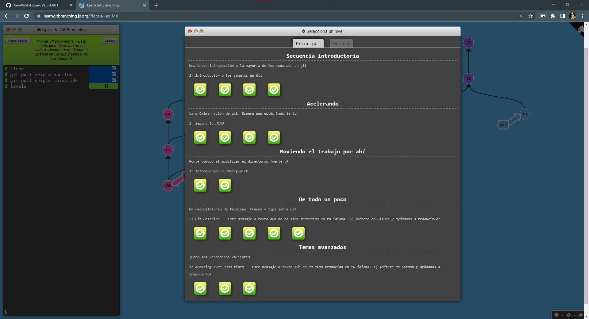
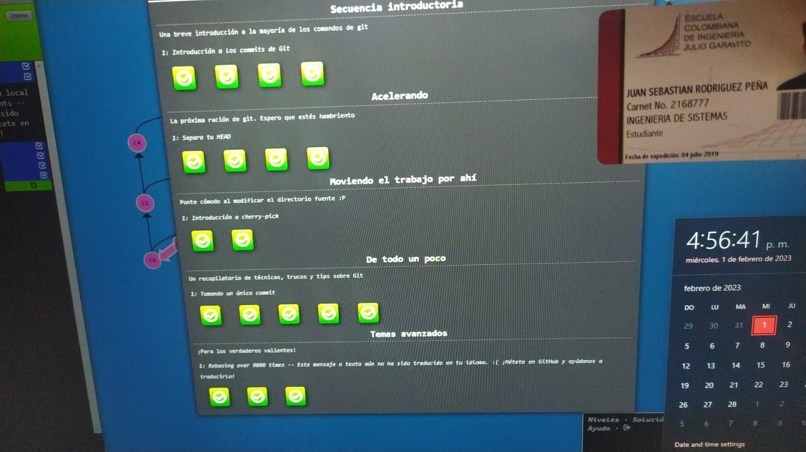
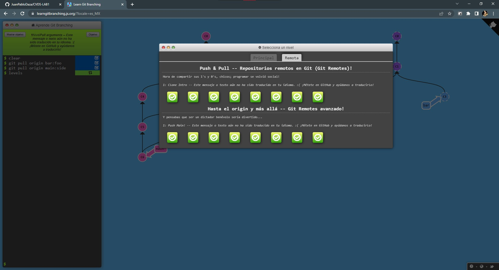
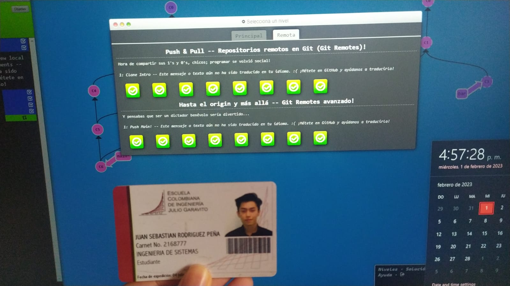

# Nombre
**Juan Sebastian Rodriguez Peña**

## Edad
*20 años*

# Informacion general
**Ingenieria de sistemas**, octavo semestre

Las cosas que mas me gusta hacer son:
* Jugar videojuegos
* Jugar futbol
* Escuchar musica
* Tocar guitarra
* Pasar tiempo con mi familia o amigos

Mis videjuegos favoritos son:
1. Assassin Creed 2
2. Spider-Man
3. The Witcher 3

[Tutorial para hacer documentos tipo Readme.md](https://commonmark.org/help/tutorial/)

~~~
for i in range(len(arreglo)):
    print(i)
~~~

# Learn Git Branching Main
[Tutorial de git](https://learngitbranching.js.org/?locale=es_MX)

**Tutorial Introduccion git**

# Learn Git Branching Remote

**tutorial de git remoto**

